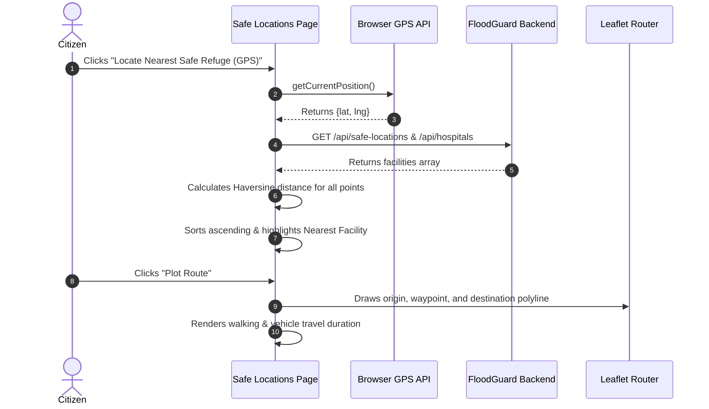
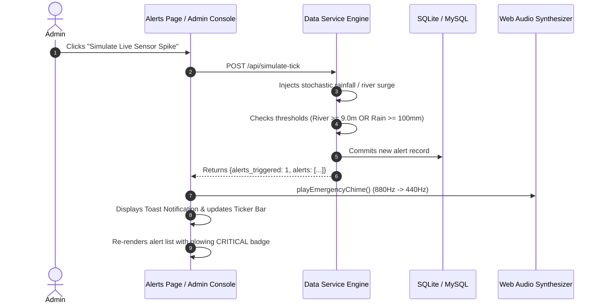

# FloodGuard: Complete UI/UX Information Architecture & Feature Wiring Specification

> **Document Version:** 2.0  
> **Target Application:** FloodGuard (GIS-Based Flood Risk Mapping & Early Warning System)  
> **Purpose:** Exhaustive wireframing, feature mapping, interaction contracts, and component wiring guide for building alternative, upgraded, or bespoke UI/UX designs.

---

## Table of Contents
1. [Executive Overview & Design Philosophy](#1-executive-overview--design-philosophy)
2. [Global Information Architecture & Sitemap](#2-global-information-architecture--sitemap)
3. [Design System Foundations & Tokens](#3-design-system-foundations--tokens)
4. [Global Persistent Shell Components](#4-global-persistent-shell-components)
5. [Page-by-Page Wireframes & Functional Blueprint](#5-page-by-page-wireframes--functional-blueprint)
   - [5.1 Home Operations Briefing (`index.html`)](#51-home-operations-briefing-indexhtml)
   - [5.2 Live Tactical GIS Map (`map.html`)](#52-live-tactical-gis-map-maphtml)
   - [5.3 Hydrological Risk Telemetry Station (`risk.html`)](#53-hydrological-risk-telemetry-station-riskhtml)
   - [5.4 Machine Learning Prediction Engine (`prediction.html`)](#54-machine-learning-prediction-engine-predictionhtml)
   - [5.5 Emergency Warnings Dispatch (`alerts.html`)](#55-emergency-warnings-dispatch-alertshtml)
   - [5.6 Safe Shelters & Evacuation Router (`safe-locations.html`)](#56-safe-shelters--evacuation-router-safe-locationshtml)
   - [5.7 Historical Flood Records & Trend Archives (`history.html`)](#57-historical-flood-records--trend-archives-historyhtml)
   - [5.8 Administrator Command Console (`admin.html`)](#58-administrator-command-console-adminhtml)
6. [User Interaction Flows & State Machines](#6-user-interaction-flows--state-machines)
7. [Frontend-to-Backend Wiring Contract (API Matrix)](#7-frontend-to-backend-wiring-contract-api-matrix)
8. [Recommended Alternative Design Archetypes](#8-recommended-alternative-design-archetypes)

---

## 1. Executive Overview & Design Philosophy

FloodGuard is an operational, real-time spatial decision-support platform designed to monitor hydrological hazards, compute multi-factor flood vulnerability, forecast inundation probabilities via machine learning, and provide life-saving evacuation pathways.

### Core UX Principles
1. **Zero-Latency Clarity in Crisis**: In an emergency, cognitive load must be minimized. Critical data (river stages, danger marks, evacuation routes) must be scannable in < 3 seconds.
2. **Geospatial Primacy**: Maps are not decorative illustrations; they are interactive analytical instruments. Layers, perimeters, telemetry pins, and elevation gradients must be easily distinguishable.
3. **Data Density without Clutter**: Provide macro-level KPIs at a glance with micro-level telemetry drill-downs on demand.
4. **Distinct Risk Spectrum**: Standardize on a universally recognized 4-tier risk classification across all badges, gauges, map fills, and table rows:
   - **LOW (0–30)**: Emerald (`#10B981`) — Nominal conditions.
   - **MEDIUM (31–60)**: Amber (`#F59E0B`) — Surveillance required.
   - **HIGH (61–80)**: Orange (`#F97316`) — Preparedness & evacuation standby.
   - **CRITICAL (81–100)**: Crimson (`#EF4444`) — Immediate threat / active breach.

---

## 2. Global Information Architecture & Sitemap

```
┌─────────────────────────────────────────────────────────────────────────────┐
│                            FLOODGUARD WEB APPLICATION                       │
└──────┬───────────────────────────────────────────────────────────────┬──────┘
       │                                                               │
       ▼                                                               ▼
[ PUBLIC INTERACTION LAYER ]                             [ ADMINISTRATIVE LAYER ]
       │                                                               │
       ├── 1. Home Briefing (`/`)                                      └── 8. Admin Operations (`/admin`)
       │      ├── Mission Overview                                            ├── Operations Statistics
       │      ├── Live Basin Telemetry Widget                                 ├── Flood Area CRUD
       │      ├── 4-Tier Risk Matrix Cards                                    ├── River Stage Overrides
       │      ├── Embedded Spatial Viewport Preview                           ├── Public Bulletin Broadcast
       │      └── 6-Step Geospatial Pipeline                                  └── Relief Camp Directory
       │
       ├── 2. Live Tactical GIS Map (`/map`)
       │      ├── Full-Screen Leaflet.js Canvas
       │      ├── Floating HUD Control Drawer
       │      ├── 6 GeoJSON Vector Layers
       │      ├── Basemap Switcher (Dark / Satellite / OSM)
       │      ├── Live Coordinate Tracker
       │      └── Geolocation ("GPS Lock")
       │
       ├── 3. Hydrological Risk Station (`/risk`)
       │      ├── Basin & Sub-Zone Selector
       │      ├── 4 Quick Scenario Presets
       │      ├── 5 Interactive Parameter Sliders
       │      ├── Semi-Circular Tachometer SVG Gauge
       │      └── 5-Factor Score Decomposition Table
       │
       ├── 4. Machine Learning Forecast (`/prediction`)
       │      ├── Parameter Ingestion Form
       │      ├── Dual Engine Output (Rule + Random Forest ML)
       │      ├── Probability Confidence Gauge
       │      ├── Expected Impact Timeframe Window
       │      └── Model Feature Correlation Weights
       │
       ├── 5. Emergency Warnings Dispatch (`/alerts`)
       │      ├── Live Broadcast Feed
       │      ├── 5 Severity Filter Tabs
       │      ├── Real-Time Telemetry Spike Simulator
       │      ├── Web Audio Warning Chime
       │      └── Direct Map Focus Links
       │
       ├── 6. Safe Shelters & Evacuation Router (`/safe-locations`)
       │      ├── Automated GPS Nearest Refuge Spotlight
       │      ├── Turn-by-Turn Route Visualizer Map
       │      ├── Multi-Modal Transit Estimates (Walk / 4x4)
       │      ├── Hazard Avoidance Warnings
       │      └── Sanctuary & Hospital Search Table
       │
       └── 7. Historical Flood Archives (`/history`)
              ├── Multi-Decadal Flood Logs
              ├── Chart.js Bar & Line Dual-Axis Trend Chart
              ├── Historical Inundation Extent Map
              └── Multi-Criteria Query Filters
```

---

## 3. Design System Foundations & Tokens

When designing a new UI, ensure all components adhere to these foundational design tokens:

### 3.1 Color Palette
| Token Name | Hex Code | Semantic Role |
| :--- | :--- | :--- |
| `--bg-space` | `#070B14` | Deepest canvas background |
| `--bg-primary` | `#0A0F1D` | Standard page background |
| `--bg-surface` | `#0E1628` | Standard card / module background |
| `--bg-surface-elevated` | `#141F36` | Hovered states, modal bodies, popups |
| `--border-subtle` | `rgba(255,255,255,0.08)` | Standard module boundary |
| `--border-tactical` | `rgba(56,189,248,0.25)` | Active monitoring containers, map frames |
| `--accent-cyan` | `#06B6D4` | Secondary telemetry accents, rivers, radar |
| `--accent-blue` | `#38BDF8` | Primary interactive buttons, links, coordinate labels |
| `--risk-low` | `#10B981` | Safe zones, open shelters, normal river levels |
| `--risk-med` | `#F59E0B` | Warning stage, moderate rainfall |
| `--risk-high` | `#F97316` | High hazard, backwater inundation |
| `--risk-crit` | `#EF4444` | Breached levees, active evacuation alerts |

### 3.2 Typography Hierarchy
- **Display / Headers:** `Plus Jakarta Sans` or `Space Grotesk` (Weight: 700 / 800, Letter spacing: `-0.02em`)
- **Body & Controls:** `Inter` or `Geist Sans` (Weight: 400 / 500 / 600)
- **Numerical Telemetry & Coordinates:** `JetBrains Mono` or `Fira Code` (Weight: 600 / 700 / 800)

### 3.3 Spatial Spacing & Elevation
- **Card Padding:** `1.5rem` to `1.75rem`
- **Border Radii:** `4px` (Tactical angular elements) to `12px` (Cards), `9999px` (Pills/Badges)
- **Z-Index System:**
  - Map Canvas: `z-index: 10`
  - Floating Map HUDs / Telemetry Ribbons: `z-index: 500`
  - Sticky Navigation Bar: `z-index: 1000`
  - Top Ticker Bar: `z-index: 1002`
  - Notification Toasts & Overlays: `z-index: 9999`

---

## 4. Global Persistent Shell Components

These components are rendered across every page view:

```
┌────────────────────────────────────────────────────────────────────────────────────────┐
│ [● BEACON] TELEMETRY ONLINE: 6 SENSORS ACTIVE | SYS CLOCK: 2026-09-13 11:25:00 UTC     │ Top Status Ticker
│ MARQUEE: [CRITICAL] EAST DELTA EMBANKMENT BREACH — IMMEDIATE EVACUATION ORDER          │
├────────────────────────────────────────────────────────────────────────────────────────┤
│ [LOGO] FloodGuard | GIS Early Warning               [Home] [Live Map] [Risk] [Alerts 3]│ Navigation Bar
└────────────────────────────────────────────────────────────────────────────────────────┘
```

### Component Breakdown
1. **Top Telemetry Status Ticker (`.telemetry-ticker-bar`)**:
   - Left: Animated pulsing green/red status beacon (`.pulse-beacon`), active sensor count.
   - Middle: Live ticking UTC & District Clock (`#mission-clock`).
   - Right: Real-time hazard marquee (`#incident-ticker-text`) showing highest active bulletin.
2. **Navigation Header (`.navbar`)**:
   - Brand icon with cyan/blue gradient glow.
   - Title: "FloodGuard", Subtitle: "GIS Early Warning".
   - Navigation links with active highlighted state (`.active`).
   - Alerts Badge (`#nav-alert-counter`): Animated pulsing badge indicating active alert count.
   - Mobile hamburger drawer toggle (`.mobile-toggle`).
3. **Emergency Web Audio Alert Chime**:
   - Web Audio API synthesizer (sine wave frequency ramp: 880Hz → 440Hz).
   - Fires on new alert broadcasts and live sensor simulation spikes.
4. **Toast Notification Engine (`showToast(msg, type)`)**:
   - Fixed bottom-right toast with type coloring (Success `#10B981`, Error `#EF4444`, Info `#0284C7`).

---

## 5. Page-by-Page Wireframes & Functional Blueprint

### 5.1 Home Operations Briefing (`index.html`)

```
┌─────────────────────────────────────────────────────────────────────────────────────────┐
│ HERO OPERATIONS BRIEFING                                                                │
│ ┌──────────────────────────────────────┐  ┌───────────────────────────────────────────┐ │
│ │ [BADGE] GEOSPATIAL EARLY WARNING     │  │ CURRENT BASIN TELEMETRY                   │ │
│ │ GIS-Based Flood Hazard Intelligence  │  │ Periyar Crest: 9.8m [DANGER BREACH]       │ │
│ │ Multi-factor hydraulic monitoring... │  │ Peak Inflow 24h: 178 mm                   │ │
│ │                                      │  │ Refuge Capacity: 5,600 (5 Camps Open)     │ │
│ │ [BTN: Launch GIS Map] [BTN: Risk]    │  │ Evacuation Status: Active (Zone B)        │ │
│ └──────────────────────────────────────┘  └───────────────────────────────────────────┘ │
├─────────────────────────────────────────────────────────────────────────────────────────┤
│ BASIN THREAT MATRIX (4 Dense KPI Cards)                                                 │
│ [Nominal Safe: 1]  [Under Monitor: 2]  [High Hazard: 1]  [Active Warnings: 3]          │
├─────────────────────────────────────────────────────────────────────────────────────────┤
│ INTERACTIVE GIS SPATIAL VIEWPORT (Preview Map)                                          │
│ ┌─────────────────────────────────────────────────────────────────────────────────────┐ │
│ │ Leaflet.js Interactive Canvas (Flood Polygons, Rivers, Relief Markers)              │ │
│ └─────────────────────────────────────────────────────────────────────────────────────┘ │
├─────────────────────────────────────────────────────────────────────────────────────────┤
│ GEOSPATIAL INTELLIGENCE ARCHITECTURE (6-Step Flow Pipeline)                             │
│ [Spatial Data] -> [Flood Analysis] -> [Risk Score] -> [GIS Map] -> [Alerts] -> [Refuge]│
└─────────────────────────────────────────────────────────────────────────────────────────┘
```

#### Key Element Wiring (DOM IDs & APIs)
- `#kpi-low`, `#kpi-med`, `#kpi-high`, `#kpi-alerts`: Populated via `GET /api/stats`.
- `#map-preview`: Leaflet map initialized with `initFloodMap('map-preview', { preview: true })`.
- Hero action buttons link to `/map` and `/risk`.

---

### 5.2 Live Tactical GIS Map (`map.html`)

```
┌─────────────────────────────────────────────────────────────────────────────────────────┐
│ FULL-SCREEN GIS WORKBENCH                                                               │
│ ┌───────────────────────────────────────┐                                               │
│ │ FLOATING HUD DRAWER                   │                                               │
│ │ ┌───────────────────────────────────┐ │                                               │
│ │ │ SPATIAL LAYERS & HUD    [GPS LOCK]│ │                                               │
│ │ │ Basemap: [Dark / Sat / OSM]       │ │                                               │
│ │ │ [Search input: zone, river...]    │ │                                               │
│ │ │ [x] Layer 1: Flood Inundation     │ │                                               │
│ │ │ [x] Layer 2: Risk Perimeters      │ │                                               │
│ │ │ [x] Layer 3: River Transects      │ │                                               │
│ │ │ [x] Layer 4: Emergency Shelters   │ │                                               │
│ │ │ [x] Layer 5: Medical Centers      │ │                                               │
│ │ │ [x] Layer 6: Weather Stations     │ │                                               │
│ │ └───────────────────────────────────┘ │                                               │
│ └───────────────────────────────────────┘                                               │
│                                                                                         │
│ (Leaflet Map Tiles + Vector Polygons + River Lines + Custom Glowing Markers)            │
│                                                                                         │
│ ┌─────────────────────────────────────────────────────────────────────────────────────┐ │
│ │ BOTTOM TELEMETRY RIBBON:                                                            │ │
│ │ Periyar: 9.8m [CRITICAL] | Rainfall: 178mm | Shelters: 5 Open | [Active Warnings (3)]│ │
│ └─────────────────────────────────────────────────────────────────────────────────────┘ │
└─────────────────────────────────────────────────────────────────────────────────────────┘
```

#### 6 Dedicated Map Layers
1. **Layer 1: Flood Inundation Polygons (`data/flood_areas.geojson`)**:
   - Visual: Semi-transparent polygon colored by risk with dashed perimeter.
   - Hover: Increases fill opacity to 0.65.
   - Click: Popup displaying Area Name, District, Rainfall (mm), River Stage (m), Elevation (m MSL), Recurrence History, and quick action buttons ("Hydraulic Risk", "Evacuate").
2. **Layer 2: Risk Perimeters (`data/risk_zones.geojson`)**:
   - Visual: Graded buffer zones delineating threat boundaries.
3. **Layer 3: Monitored River Transects (`data/rivers.geojson`)**:
   - Visual: Dynamic polylines (Cyan for normal, Amber for warning >7.5m, Red for danger >9.0m).
4. **Layer 4: Emergency Shelters (`data/shelters.geojson`)**:
   - Visual: Emerald green shield markers with house icons.
   - Popup: Capacity, current occupancy, altitude safety, and "Navigate Evacuation Route" button.
5. **Layer 5: Medical Trauma Centers (`data/hospitals.geojson`)**:
   - Visual: Crimson markers with medical cross and pulsing hazard ring.
   - Popup: Total beds, available ICU beds, ambulance hotline, direct phone.
6. **Layer 6: Weather Rain Stations (`data/rainfall_stations.geojson`)**:
   - Visual: Azure weather icons with 24h precipitation readout.

#### Tactical HUD Controls
- `#basemap-select`: Toggles between CartoDB Dark, Esri World Imagery, and OpenStreetMap.
- `#hud-cursor-coords`: Live coordinates updated on `map.on('mousemove')`.
- `#map-search-input`: Searches flood areas and shelters on `Enter` key and auto-pans/zooms.
- `locateUser()`: GPS geolocation with coordinate lock toast.

---

### 5.3 Hydrological Risk Telemetry Station (`risk.html`)

```
┌─────────────────────────────────────────────────────────────────────────────────────────┐
│ HYDROLOGICAL RISK TELEMETRY STATION                                                     │
│ Quick Scenario Presets: [Severe Monsoon] [Dam Spillway] [Urban Flood] [Nominal Base]   │
├─────────────────────────────────────────┬───────────────────────────────────────────────┤
│ SIMULATOR INPUT MATRIX                  │ REAL-TIME TACHOMETER & BREAKDOWN              │
│ ┌─────────────────────────────────────┐ │ ┌───────────────────────────────────────────┐ │
│ │ Basin: Central Basin District       │ │ │         /\  TACHOMETER GAUGE              │ │
│ │ Sub-Zone: [Select Area Dropdown]    │ │ │       /    \ (Needle Pivots -90° to +90°) │ │
│ ├─────────────────────────────────────┤ │ │            [ 74.5 / 100 ]                 │ │
│ │ 1. Cumulative Rainfall: 85 mm       │ │ │            [HIGH RISK BADGE]              │ │
│ │    [======O==================]      │ │ │ 0 LOW | 31 MED | 61 HIGH | 81 CRITICAL    │ │
│ │ 2. River Water Stage: 7.2 m         │ │ ├───────────────────────────────────────────┤ │
│ │    [===========O=============]      │ │ │ TACTICAL RESPONSE ADVISORY                │ │
│ │ 3. Topography Elevation: 6 m MSL    │ │ │ "Inundation probable. Prepare go-bags..." │ │
│ │    [=====O===================]      │ │ ├───────────────────────────────────────────┤ │
│ │ 4. River Distance: 180 m            │ │ │ [BTN: Designated Shelters] [BTN: ML Model]│ │
│ │    [====O====================]      │ │ └───────────────────────────────────────────┘ │
│ │ 5. Historical Frequency: [Moderate] │ │ ┌───────────────────────────────────────────┐ │
│ └─────────────────────────────────────┘ │ │ FACTOR SCORE DECOMPOSITION TABLE          │ │
│                                         │ │ Rainfall: 20/30 pts | River: 20/30 pts... │ │
│                                         │ └───────────────────────────────────────────┘ │
└─────────────────────────────────────────┴───────────────────────────────────────────────┘
```

#### Mathematical Risk Scoring Formula
$$\text{Total Score} = \text{RainScore} (30) + \text{RiverScore} (30) + \text{HistScore} (20) + \text{ProxScore} (20) + \text{ElevMod} (\pm 8)$$
- Classified into **LOW (0–30)**, **MEDIUM (31–60)**, **HIGH (61–80)**, **CRITICAL (81–100)**.
- Sliders wire dynamically to `API.calculateRisk(...)` on `input` events with real-time tachometer needle update.

---

### 5.4 Machine Learning Prediction Engine (`prediction.html`)

```
┌─────────────────────────────────────────────────────────────────────────────────────────┐
│ PREDICTIVE HYDROMETRIC INTELLIGENCE                                                     │
├─────────────────────────────────────────┬───────────────────────────────────────────────┤
│ TELEMETRY PARAMETER INGESTION           │ HAZARD INFERENCE RESULT                       │
│ ┌─────────────────────────────────────┐ │ ┌───────────────────────────────────────────┐ │
│ │ Target Area: [East Delta Zone B]    │ │ │ Target: East Delta Sector [CRITICAL RISK] │ │
│ │ Forecast Rainfall: 145 mm / 24h     │ │ ├───────────────────────────────────────────┤ │
│ │ River Water Level: 8.9 m            │ │ │ INUNDATION PROBABILITY: [ 88% ]           │ │
│ │ Weather Scenario: [Severe Monsoonal]│ │ │ [██████████████████████████████░░░░░]     │ │
│ │ Elevation: 3.5 m MSL                │ │ │ Expected Impact: Next 2 - 6 Hours         │ │
│ │ River Distance: 90 m                │ │ ├───────────────────────────────────────────┤ │
│ │                                     │ │ │ METHOD COMPARISON:                        │ │
│ │ [BTN: Compute ML & Heuristic]       │ │ │ Method 1 (Rule): CRITICAL (86/100)        │ │
│ └─────────────────────────────────────┘ │ │ Method 2 (ML): Random Forest (100 Trees)  │ │
│                                         │ ├───────────────────────────────────────────┤ │
│                                         │ │ FEATURE WEIGHT CORRELATION                  │ │
│                                         │ │ Rain: 34.2% | River: 31.8% | Elev: 15.4%   │ │
│                                         │ └───────────────────────────────────────────┘ │
└─────────────────────────────────────────┴───────────────────────────────────────────────┘
```

#### ML Engine Specs
- Backend Model: `RandomForestClassifier(n_estimators=100)` and `DecisionTreeClassifier`.
- Features: `[rainfall_mm, river_level_m, elevation_m, distance_from_river_m, historical_freq_code]`.
- Output: Flood Probability Percentage (`88%`), Impact Time Window (`Next 2 - 6 Hours`), and Class Confidence Breakdown.

---

### 5.5 Emergency Warnings Dispatch (`alerts.html`)

```
┌─────────────────────────────────────────────────────────────────────────────────────────┐
│ PUBLIC DISASTER BROADCAST TERMINAL           [BTN: Simulate Live Sensor Spike]          │
├─────────────────────────────────────────────────────────────────────────────────────────┤
│ FILTER TABS: [All Warnings] [Critical Breaches] [High Hazard] [Monitoring] [Advisories] │
├─────────────────────────────────────────────────────────────────────────────────────────┤
│ ┌─────────────────────────────────────────────────────────────────────────────────────┐ │
│ │ [CRITICAL BADGE] [Critical Flood Alert] [● ACTIVE]              2026-09-13 | 10:45  │ │
│ │ CRITICAL FLOOD ALERT: East Delta Embankment Breach                                  │ │
│ │ Water level in Periyar Main Stem reached 9.8m, exceeding danger threshold (9.0m)... │ │
│ │ Location: East Delta Sector (Zone B)                                                │ │
│ │ [BTN: View on GIS Map] [BTN: Find Nearby Shelter]                                   │ │
│ └─────────────────────────────────────────────────────────────────────────────────────┘ │
│ ┌─────────────────────────────────────────────────────────────────────────────────────┐ │
│ │ [HIGH BADGE] [Heavy Rainfall Alert] [● ACTIVE]                  2026-09-13 | 10:30  │ │
│ │ HIGH FLOOD RISK: North Riverdale Lowlands (Zone A)                                  │ │
│ │ [BTN: View on GIS Map] [BTN: Find Nearby Shelter]                                   │ │
│ └─────────────────────────────────────────────────────────────────────────────────────┘ │
└─────────────────────────────────────────────────────────────────────────────────────────┘
```

#### Event-Driven Trigger Pipeline
$$\text{Sensors} \rightarrow \text{Validation} \rightarrow \text{Threshold Check} \rightarrow \text{Auto-Generate Alert} \rightarrow \text{Sync DB & Map} \rightarrow \text{Broadcast UI & Audio}$$

---

### 5.6 Safe Shelters & Evacuation Router (`safe-locations.html`)

```
┌─────────────────────────────────────────────────────────────────────────────────────────┐
│ CIVIL DEFENSE & REFUGE CORRIDOR               [BTN: Locate Nearest Safe Refuge (GPS)]   │
├─────────────────────────────────────────────────────────────────────────────────────────┤
│ OPTIMAL DISPATCH REFUGE SPOTLIGHT                                                       │
│ ┌─────────────────────────────────────────────────────────────────────────────────────┐ │
│ │ [OPTIMAL REFUGE] Riverdale Community Center & Relief Camp                           │ │
│ │ 45 Highland Ring Road | [Power Gen] [Potable Water] [Medical Aid] [Helipad]         │ │
│ │ Proximity: 1.2 KM  |  Capacity: 850 Persons  |  [BTN: Plot Evacuation Route]       │ │
│ └─────────────────────────────────────────────────────────────────────────────────────┘ │
├─────────────────────────────────────────┬───────────────────────────────────────────────┤
│ GEOSPATIAL EVACUATION VECTOR (Map)      │ TRANSIT TIME CALCULATOR                       │
│ ┌─────────────────────────────────────┐ │ ┌───────────────────────────────────────────┐ │
│ │ Leaflet Map with:                   │ │ │ Origin: [District Central Operations Hub] │ │
│ │ - Origin Marker (Blue)              │ │ │ Destination: [Riverdale Community Center] │ │
│ │ - Destination Marker (Emerald)      │ │ ├───────────────────────────────────────────┤ │
│ │ - Dashed Evacuation Polyline Vector │ │ │ Walking Pace (4.5 km/h): ~ 16 Mins        │ │
│ │ - Safe bypass routing               │ │ │ Emergency 4x4 Vehicle:   ~ 4 Mins         │ │
│ └─────────────────────────────────────┘ │ ├───────────────────────────────────────────┤ │
│                                         │ │ [!] Hazard Protocol: Route uses elevated  │ │
│                                         │ │ bypass avoiding riverside underpasses.    │ │
│                                         │ └───────────────────────────────────────────┘ │
├─────────────────────────────────────────┴───────────────────────────────────────────────┤
│ REFUGE DIRECTORY & MEDICAL HUBS TABLE (Category Filters: All / Shelters / Hospitals)   │
└─────────────────────────────────────────────────────────────────────────────────────────┘
```

#### Proximity Engine
- Computes Haversine great-circle distance between current user GPS and all points in `safe_locations` and `hospitals`.
- Sorts ascending and spotlights the nearest facility.
- Calculates walking (~4.5 km/h) and vehicle (~25 km/h wet) transit times.

---

### 5.7 Historical Flood Records & Trend Archives (`history.html`)

```
┌─────────────────────────────────────────────────────────────────────────────────────────┐
│ MULTI-DECADAL HYDROMETRIC ARCHIVE                                                       │
│ Filters: Year [All v] | Severity [All v] | District [Input...] | [BTN: Filter Records]   │
├─────────────────────────────────────────┬───────────────────────────────────────────────┤
│ TREND VISUALIZER (Chart.js Canvas)      │ HISTORICAL INUNDATION SPATIAL FOOTPRINTS      │
│ ┌─────────────────────────────────────┐ │ ┌───────────────────────────────────────────┐ │
│ │ Dual-Axis Bar & Line Chart:         │ │ │ Leaflet Inundation Map                    │ │
│ │ - Left Axis: Peak Rainfall (mm)     │ │ │ Renders risk zones colored by historical  │ │
│ │ - Right Axis: River Crest Stage (m) │ │ │ breach perimeters                         │ │
│ └─────────────────────────────────────┘ │ └───────────────────────────────────────────┘ │
├─────────────────────────────────────────┴───────────────────────────────────────────────┤
│ HISTORICAL INCIDENT CATALOG TABLE                                                       │
│ Year | Location | Severity | Duration | Affected Area | Rainfall | River | Evacuated    │
└─────────────────────────────────────────────────────────────────────────────────────────┘
```

---

### 5.8 Administrator Command Console (`admin.html`)

```
┌─────────────────────────────────────────────────────────────────────────────────────────┐
│ ROOT ADMINISTRATIVE OPERATIONS CONSOLE                  [● Root Authenticated]          │
├─────────────────────────────────────────────────────────────────────────────────────────┤
│ 4 Telemetry Stats: [Areas: 5]  [Critical: 2]  [Shelters: 5]  [Hospitals: 4]             │
├─────────────────────────────────────────────────────────────────────────────────────────┤
│ NAVIGATION TABS:                                                                        │
│ [1. Flood Areas CRUD]  [2. River Telemetry]  [3. Emergency Alerts]  [4. Safe Locations] │
├─────────────────────────────────────────────────────────────────────────────────────────┤
│ TAB 1 CONTENT:                                                                          │
│ ┌──────────────────────────────────────┐  ┌───────────────────────────────────────────┐ │
│ │ ADD / UPDATE FLOOD AREA FORM         │  │ CONFIGURED FLOOD AREAS TABLE              │ │
│ │ Area Name, Lat, Lng, Risk Level,     │  │ Area Name | Risk | Rainfall | Water | Act │ │
│ │ Rainfall, Water Level, Description   │  │ Zone A    | High | 135.5mm  | 8.7m  |[Del]│ │
│ │ [BTN: Save Flood Area]               │  │ Zone B    | Crit | 178.0mm  | 9.8m  |[Del]│ │
│ └──────────────────────────────────────┘  └───────────────────────────────────────────┘ │
└─────────────────────────────────────────────────────────────────────────────────────────┘
```

---

## 6. User Interaction Flows & State Machines

### 6.1 User Flow: Emergency GPS Evacuation


### 6.2 User Flow: Live Telemetry Spike & Alert Broadcast


---

## 7. Frontend-to-Backend Wiring Contract (API Matrix)

| Endpoint | HTTP Method | Frontend Caller / Trigger | Request Payload | Response Data |
| :--- | :--- | :--- | :--- | :--- |
| `/api/stats` | `GET` | Page load (`index`, `admin`, `alerts`) | None | `{ total_areas, low_risk, medium_risk, high_risk, critical_risk, active_alerts, open_shelters, hospitals_count, monitored_rivers, latest_alert }` |
| `/api/geojson/<layer>` | `GET` | Leaflet layer loader (`map.js`, `history.js`) | None | GeoJSON `FeatureCollection` (Points, LineStrings, or Polygons) |
| `/api/flood-areas` | `GET` | Area dropdowns, Admin table | None | Array of flood area records |
| `/api/flood-areas` | `POST` | Admin "Add Flood Area" form | `{ area_name, latitude, longitude, risk_level, rainfall, water_level, elevation, distance_to_river, description }` | `{ message, id }` |
| `/api/flood-areas/<id>` | `DELETE` | Admin delete button | None | `{ message }` |
| `/api/calculate-risk` | `POST` | Simulator sliders (`risk.js`) | `{ rainfall, river_level, flood_history, elevation, distance_from_river }` | `{ risk_score, risk_level, color, action_advisory, breakdown }` |
| `/api/predict-flood` | `POST` | Forecast form (`prediction.js`) | `{ location, rainfall, river_level, weather_data, elevation, distance_from_river }` | `{ location, predicted_risk, flood_probability, expected_risk_time, color, method_1_rule_based, method_2_machine_learning }` |
| `/api/alerts` | `GET` | Alerts page, Nav badge | Query params: `status`, `risk_level` | Array of alert records |
| `/api/alerts` | `POST` | Admin broadcast form | `{ title, description, location, risk_level, alert_type }` | `{ message, id }` |
| `/api/alerts/<id>` | `PUT` | Admin resolve button | `{ status: "RESOLVED" }` | `{ message }` |
| `/api/safe-locations` | `GET` | Shelter table, Route engine | None | Array of shelter records |
| `/api/hospitals` | `GET` | Medical table, Route engine | None | Array of hospital records |
| `/api/rivers` | `GET` | Rivers table, HUD | None | Array of river telemetry records |
| `/api/rivers/<id>` | `PUT` | Admin river level override | `{ water_level: 9.8 }` | `{ message }` (re-evaluates alerts) |
| `/api/history` | `GET` | History table & Chart.js | Query params: `year`, `severity`, `district` | Array of historical records |
| `/api/simulate-tick` | `POST` | "Simulate Spike" button | None | `{ status, alerts_triggered, alerts }` |

---

## 8. Recommended Alternative Design Archetypes

If you wish to create a completely new aesthetic skin or framework variation, choose from these proven archetypes:

### Archetype A: Crisp Government / Civic Resilience (Light Mode)
- **Visual Style:** Ultra-clean white and light zinc canvas (`#F8FAFC`, `#FFFFFF`), deep navy text (`#0F172A`), high-contrast colored pills.
- **Best For:** Public distribution, municipal portal integration, citizens viewing on mobile screens in direct sunlight.
- **Key Tokens:**
  - Background: `#FFFFFF`
  - Cards: `#F8FAFC` with hairline border `#E2E8F0`
  - Primary: Royal Blue `#1D4ED8`
  - Badges: Soft tinted backgrounds with dark text (`rgba(220, 38, 38, 0.1)` with text `#991B1B`)

### Archetype B: Cyber Tactical Mission Control (Dark Mode — Implemented)
- **Visual Style:** Obsidian night sky (`#070B14`, `#0A0F1D`), phosphor cyan and orange indicators, tachometer dials, hairline grid textures.
- **Best For:** Emergency operations centers (EOC), disaster rooms, dispatch dashboards.
- **Key Tokens:**
  - Background: `#070B14`
  - Cards: `rgba(14, 22, 40, 0.88)`
  - Accents: Electric Cyan (`#06B6D4`), Danger Crimson (`#EF4444`)

### Archetype C: Glassmorphic Neo-Brutalist
- **Visual Style:** Bold black typography, thick solid borders (2px solid `#000000`), vibrant flat contrast tags, zero subtle gradients.
- **Best For:** High-energy educational demos, modern fintech/disaster tech hackathons.
- **Key Tokens:**
  - Card Shadow: `4px 4px 0px #000000`
  - Font: `Space Grotesk` + `Chivo Mono`

---

## Summary
Every feature, slider, coordinate, and API route in the FloodGuard platform is mapped above. Use this architectural specification as your **single source of truth** when iterating, creating Figma/Sketch mockups, or developing alternative frontend frameworks (e.g. React, Next.js, or Tailwind CSS)!
